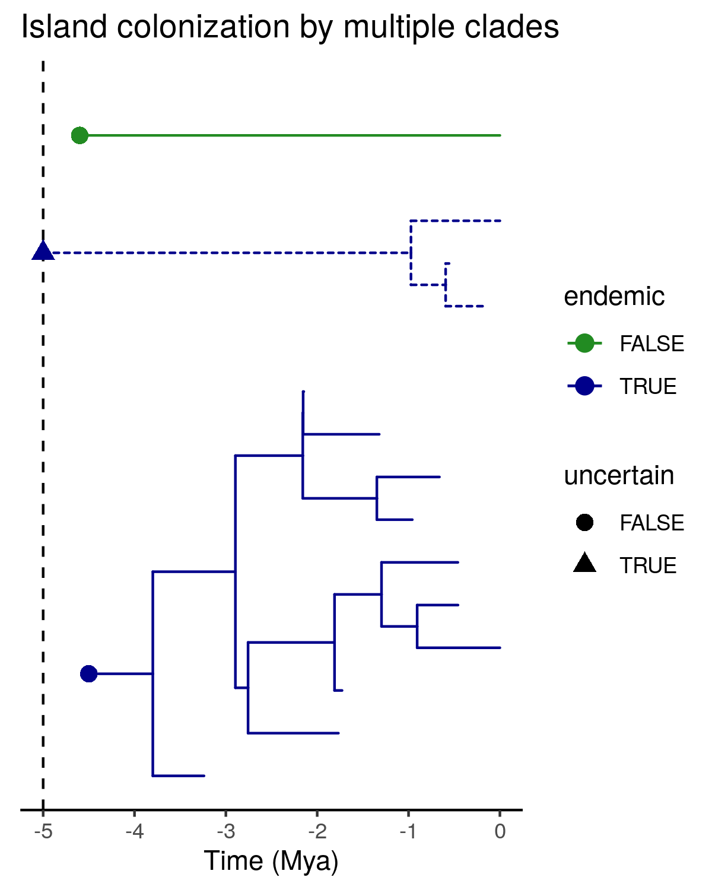

# daisietreeplot

This repository contains R code for the `daisietreeplot` function to be added to the R package DAISIE.

The function will be added to the package, so for documentation please refer to `?DAISIE::daisietreeplot`.

The `scratchpad.R` file in this repository contains an example of how to use the function.

The result is shown here:

